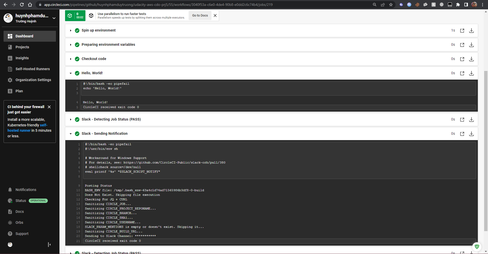

# Udacity Cloud DevOps Engineer: Project 05 - Capstone

This is final project of Udacity Cloud DevOps Engineer Nanodegree Program. In this project we'll apply the skills and knowledge that I've learn from the nanodegree, including:

- Working with AWS
- Using CircleCI to implement CI/CD
- Building pipelines
- Building Kubernetes clusters
- Building Docker containers in pipelines

## Application

This is a simple "Hello, World!" site deploy and hosted with nginx for demonstration

## Extra things done in this project

- Integrate Slack to send notification describe the result of the jobs
- Check to see whether the app is successfully running and rolled out
- Map custom domain to LoadBalancer DNS Name

## Steps & Screenshots

1. Creating config file for CircleCI

Quick 10s demonstration

The pipeline:

Some messages when CircleCI notify to Slack:

2. Deploy our app

- Setup the EKS cluster: I've used `ekscli` to setup the cluster automatically through the pipeline ([`create-cluster` job](https://github.com/huynhphamduytruong/udacity-aws-cdo-prj5/blob/f2abf1e489856faf0041fdbc61f4a66ba53a2e59/.circleci/config.yml#L41))

- Try some Hello, World

- Linting the Dockerfile

I've done for both failed and succeed cases, as shown in the screenshots below

Lint failed:

Lint succeed:

- Build and push the image to dockerhub

- Create and deploy k8s resources

I've created `k8s.yml` file, which contains all the resources needed for the project. The LoadBalancer get deployed as service with an external IP, running on port 80.

I've also create an DNS record to point to the LoadBalancer DNS so that we can connect through that domain, thus will lead us to the app.

Deployment result:

EC2 nodes:

- For post-deployment step, I've using `curl` to check if the app is up and running at port 80

- Finally, I check if the app successfully rolled out or not

3. Check to see if the app is up and live

I've access the app through both the LoadBalancer DNS and my custom DNS and confirm that both working as expected.

## How to access to the app

- Through LoadBalancerDNS: [http://a75399f2efef64292924cb5ec6e89f42-936222220.us-east-1.elb.amazonaws.com](http://a75399f2efef64292924cb5ec6e89f42-936222220.us-east-1.elb.amazonaws.com)

- My custom domain: [https://capstone.truonghuynhit.com](https://capstone.truonghuynhit.com)

## Final words

Thanks for the silly tool here: [whatthecommit - Commit Message Generator](https://whatthecommit.com/) ([github](https://github.com/lwe/whatthecommit)) for helping me get though the tough time when trying to doing this capstone project 😅.
